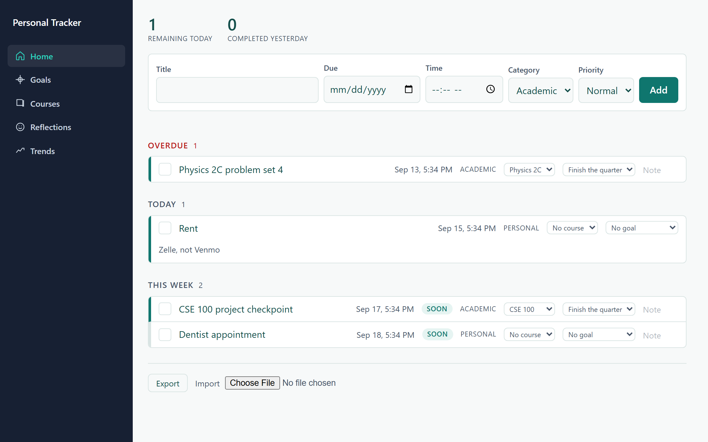

# Personal Tracker

[](https://github.com/AdityaJadhav17/Personal-Tracker/actions/workflows/ci.yml)

A personal dashboard for deadlines, goals, courses and how your days are
going. It runs in your browser on your own laptop. No account, no server,
nothing leaves the machine.



## What it does

Six views, in a sidebar, and a button at its foot that switches between light
and dark. With no choice made, the app follows your system.

**Home** holds anything with a date and a consequence: a midterm, rent, a
dentist appointment, a friend's birthday. Two numbers at the top say what is
left today and what you finished yesterday, then the list sorts itself.

- **Overdue** sits above everything, so you never scroll past something you
  have already missed. Each overdue row asks for one decision: done,
  **Tomorrow** (same time, next day), a new date, or **Drop**, which asks first.
  The pile empties instead of growing.
- **Today**, **This week** and **Later** follow. A group with nothing in it does
  not render at all.
- Only the next ten upcoming show, so a whole term never buries this week.
  Overdue items all show and do not count towards the ten. **Show more**
  reveals the rest until you reload.
- Inside each group, whatever is due soonest comes first. On the same day, high
  priority leads.
- Anything due in the next three days carries a **Soon** marker, whatever its
  priority.

Show All, Academic or Personal to narrow the list to one kind of thing, and pick
a course to narrow it to one class. The two combine, so you can ask for academic
work for CSE 110. The course control only appears once you have a course. Neither
choice is remembered: a reload shows everything again, because a filter you
forgot you set is a list that is lying to you.

Set something to repeat weekly or monthly and finishing it creates the next one,
so rent is recorded once instead of twelve times a year. The next one only
appears when you finish the last, which means a repeating item you ignore stops
repeating. Open an item to start or stop it repeating later, so
moving out means switching rent off rather than deleting it. The calendar
shows the months ahead anyway, with each repeat drawn dashed until it is real.

Pick a date, and a time if it needs one. With no time, a deadline means 23:59
that day. Dates are stored as fixed moments, so a deadline set at 5pm still
reads as 5pm on the other side of a daylight saving change.

Mark something done from the keyboard, and press `u` to undo if you hit the
wrong row.

A row shows what a thing is rather than how to change it: its title, when it is
due, the course and goal it belongs to, and anything you wrote about it. Click
the title to open the controls that change those. Done stays outside, so
finishing something never means opening it first.

The same panel is where you rename something, move its deadline when a professor
does, or delete it outright. Deleting asks first and then really deletes: it is
not marked done, so it never inflates what you finished.

A project that takes more than an evening can be broken into **steps**: open it
and add a step with its own title and date. Each step is a deadline in its own
right, in the list, on the calendar and on your phone, and it takes the
project's course and goal. The project says how many of its steps are done.
Deleting a project takes its steps with it, and says so first.

**Calendar** lays the same items out as a month, so you can tell a heavy week
from a light one before it arrives. A column counts each week's deadlines and
marks six or more as heavy. Goals show on their target day, outlined so they
never read as one more deadline. Today is marked, and finished items drop off,
matching Home.

Press anywhere in a day and it opens beside it with every row in full, so
anything a row can do on Home works from the calendar too, including changing
its date from the keyboard. The title field is ready at the bottom: type and
press Enter to add something to that day. Escape closes it. Drag an item to another day to
move its deadline, keeping its time; hold it over Next month or Previous month
to carry it further.

**Goals** are things to aim at with a date on them. Items can belong to a goal,
and each goal shows how much of its work is finished.

**Courses** keeps the details you would otherwise dig out of email every week:
where it meets, your professor's address, when office hours are.

**Reflections** asks how the day went, on a scale of five, with a note. One
entry per day.

**Trends** plots those scores and what you finished, one point per day, with
the same numbers in a table underneath.

Paste a list fills a whole term at once: one line each, a date, an optional
time, then the title. It shows you what every line was understood as, and lists
the ones it could not read, before anything is saved. The format is strict on
purpose: it reports a line it cannot read rather than guessing at it.

Add from calendar file reads an `.ics` from Canvas or a course site, the
"Download iCal File" kind. It shows what it found and what it left out, such as
anything already past or already in your list, and adds nothing until you press
Add. It can put everything under one course. You do the download; the app still
makes no network request.

Export everything to a JSON file you keep, and import it back on another
machine. Files written by the first version still import. Once a week has
passed since the last export, a line by the Export button says so.

Export calendar writes an `.ics` file of every open deadline, with reminders
set by priority: a high priority item warns a day before and an hour before, a
normal one at 8pm the evening before, and a low one not at all. Import it into
the calendar on your phone and the phone
does the reminding, which is the only way this app reaches you while it is
closed. Re-importing updates the events rather than duplicating them.

## Run it

You need [Node](https://nodejs.org) 20 or newer.

```bash
git clone https://github.com/AdityaJadhav17/Personal-Tracker.git
cd Personal-Tracker
npm install
npm run dev
```

That serves the app at http://localhost:5173. Nothing else to configure, and no
database to set up: your deadlines live in the browser's own storage.

## Use it every day

`npm run dev` is for working on the app. To use it without opening a terminal,
build a copy outside the repo and serve that instead:

```bash
npm run deploy   # builds into %LOCALAPPDATA%\PersonalTracker
npm run live     # serves it at http://localhost:4180, this laptop only
```

The copy lives outside the repo so that a build on a half-finished branch never
changes the app you rely on. It only changes when you run `deploy` again, and
the running server picks the new files up without a restart: reload the window.

To start `live` at login, run this once in PowerShell from the repo folder. It
puts a shortcut in your Startup folder that opens a minimized window; close the
window to stop the server, delete the shortcut to stop it starting.

```powershell
$s = (New-Object -ComObject WScript.Shell).CreateShortcut("$([Environment]::GetFolderPath('Startup'))\Personal Tracker.lnk"); $s.TargetPath = $env:ComSpec; $s.Arguments = '/c npm run live'; $s.WorkingDirectory = (Get-Location).Path; $s.WindowStyle = 7; $s.Save()
```

Then open http://localhost:4180 and install it as an app: in Chrome, the ⋮ menu,
then **Cast, save, and share**, then **Install page as app**; in Edge, Apps,
then **Install this site as an app**. Pin it to the taskbar. Stay with one
browser: each keeps its own copy of the data.

`npm run deploy` checks its own output and fails, naming the files, if the
deployed `index.html` and its assets do not match.

### Updates by themselves

Once this is set up, pushing to `main` is enough: four to eight minutes later,
once CI has passed, the app has the change and a reload shows it. A commit
whose CI failed is never deployed.

Run this once from the repo folder. It makes its own clone in
`%LOCALAPPDATA%\PersonalTracker-src` and deploys `main`:

```powershell
node scripts/update.mjs
```

Then register the task that runs it every five minutes, with no window:

```powershell
$node = (Get-Command node).Source; $script = "$env:LOCALAPPDATA\PersonalTracker-src\scripts\update.mjs"; $action = New-ScheduledTaskAction -Execute 'conhost.exe' -Argument "--headless `"$node`" `"$script`""; $every = New-ScheduledTaskTrigger -Once -At (Get-Date) -RepetitionInterval (New-TimeSpan -Minutes 5); $settings = New-ScheduledTaskSettingsSet -StartWhenAvailable -MultipleInstances IgnoreNew -ExecutionTimeLimit (New-TimeSpan -Minutes 30) -AllowStartIfOnBatteries -DontStopIfGoingOnBatteries; Register-ScheduledTask -TaskName 'Personal Tracker update' -Action $action -Trigger $every -Settings $settings
```

To skip the wait after a push, run `Start-ScheduledTask 'Personal Tracker update'`.
What it did is in `%LOCALAPPDATA%\PersonalTracker-update.log`. To stop it,
`Unregister-ScheduledTask 'Personal Tracker update'`.

**Your data does not move by itself.** The browser keeps storage per address,
so 4180 starts empty. Export from 5173 once, Import it at 4180, and from then
on 4180 holds your real deadlines and 5173 is only for development.

## Test it

```bash
npm test          # unit and component tests, with coverage
npm run e2e       # end to end in a real browser
npm run lint      # eslint, fails on any warning
npm run typecheck # tsc
npm run build     # typecheck, then a production build
```

The end-to-end suite drives a real Chromium, so install it once:

```bash
npx playwright install chromium
```

## Your data

Everything sits in this browser's `localStorage`, under one key. It never
travels: the app makes zero network requests after the page loads, and a
Playwright spec checks that on every CI run.

Two things follow from that.

**Clearing site data deletes your deadlines.** Use Export now and then, and keep
the file somewhere you trust. Import restores it exactly, which a round-trip
test proves against a real downloaded file.

**Anyone at your unlocked laptop can read it,** as can any browser extension you
have installed. The app stores plain text and does not encrypt anything, on the
reasoning that full-disk encryption already covers the realistic threat and a
passphrase prompt would wreck an app whose whole value is being quick to check.
[docs/engineering/decisions.md](docs/engineering/decisions.md) records that trade in full.

Exported files match a pattern in `.gitignore`, so you cannot commit your own
deadlines by accident.

## Not in this version

No accounts, no cloud sync, no hosted backend, no mobile app, no collaboration.
GitHub holds the source and nothing else.

Also absent, and deliberately: push notifications. A browser tab on a laptop
cannot reach your phone without a server, so the app itself reminds you only
while it is open. The calendar export routes around that by letting your phone's
own calendar do the reminding.
[docs/product/v3-plan.md](docs/product/v3-plan.md) is the proposal for a private
server that would add nudges, and it is waiting on a spike.

## How it is built

React 18 and TypeScript on Vite. Vitest with React Testing Library for unit and
component tests, Playwright for end to end.

Two runtime dependencies, React and React DOM. No component library, no state
library, no router, no date library and no chart library: the sidebar icons and
the trend charts are inline SVG, and the colour palette is checked for contrast
by a test that reads the design tokens. Every view is also scanned for WCAG 2.2
AA in both colour schemes on every CI run,
and again with the system asking for more contrast, which strengthens borders
and muted text. Text sizes are in rem, so Chrome's font size setting scales
them.

[docs/](docs/README.md) holds the rest: the user research every test ID traces
back to, the data model, and a decision log that explains why each choice went
the way it did, including the ones that were wrong first.

## Licence

MIT. See [LICENSE](LICENSE).
